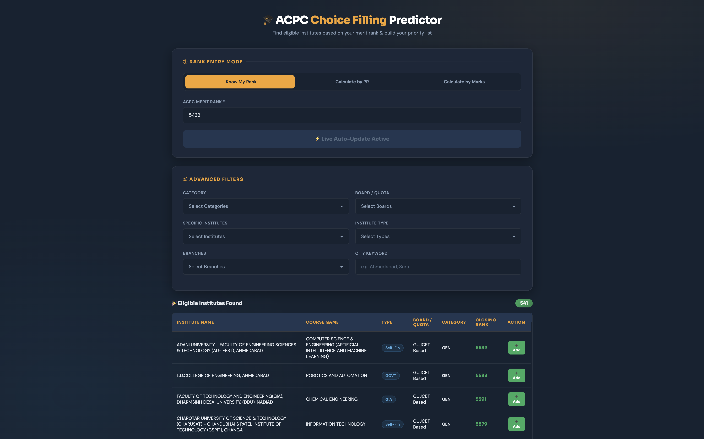
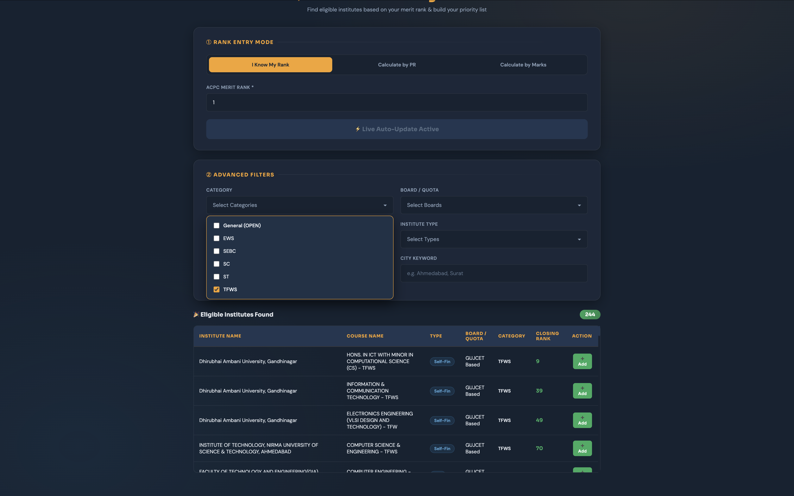
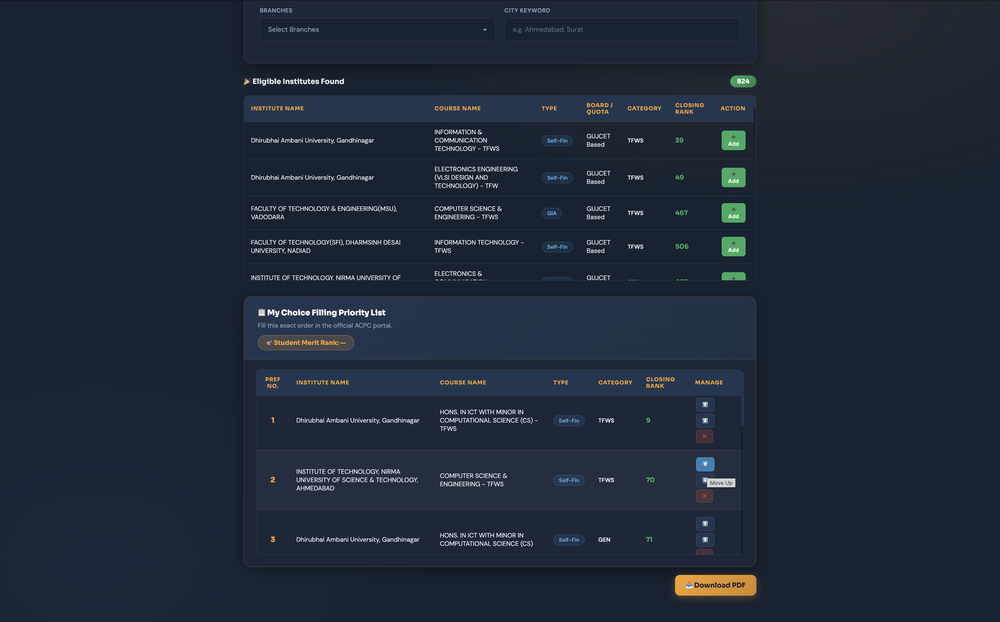

# 🎓 Advanced ACPC Merit Rank Predictor & Choice Filling Engine


## 📌 Overview
The **Advanced ACPC Merit Rank Predictor** is a full-stack web application designed to help engineering aspirants in Gujarat make data-driven admission decisions. It accurately predicts a student's ACPC merit rank based on historical cutoff data and allows them to build, manage, and export a personalized Choice Filling Priority List for the official ACPC admission portal.

## 🚀 Key Features

### 1. 3-Way Rank Entry Mode
* **I Know My Rank:** Direct entry for students who already have their official ACPC rank.
* **Calculate by PR:** Enter Board (PCM) and GUJCET Percentiles to estimate the rank.
* **Calculate by Marks:** Enter raw PCM and GUJCET marks. The Python backend maps these marks to accurate PRs using dual-year historical data (2024 & 2025) and calculates a highly accurate estimated rank using the official ACPC formula (50% Board + 50% GUJCET).

### 2. Smart College Predictor & Filters
Real-time, asynchronous filtering of thousands of college records across Gujarat. Users can filter by:
* **Category:** General (OPEN), EWS, SEBC, SC, ST, and TFWS.
* **Institute Type:** Government (GOVT), Grant-in-Aid (GIA), Self-Finance.
* **Specific Branches & Boards** (GUJCET Based / JEE Based).
* **City Keyword Search** (e.g., Ahmedabad, Surat).

### 3. Interactive Choice Filling Builder
* **Add to List:** Instantly add eligible colleges to a "Priority List".
* **Auto-Sorting:** Colleges are automatically sorted by their closing ranks.
* **Manage Preferences:** Reorder colleges using ⬆️ (Up) and ⬇️ (Down) buttons or ❌ Delete them to perfect the strategy.

### 4. One-Click PDF Export
* Generates a clean, professional PDF of the final priority list using `html2pdf.js`.
* Automatically tags the PDF file name and header with the student's predicted rank (e.g., `ACPC_Choice_Filling_Rank_4000.pdf`).

---

## 📸 Screenshots

### Rank Entry & Prediction Mode
> *Allows users to calculate rank via Marks, PR, or manual entry.*
<!-- ADD YOUR SCREENSHOT HERE (Rank Entry Box Image) -->


### Advanced Filters & Real-Time Search
> *Live updating table fetching data based on user criteria.*
<!-- ADD YOUR SCREENSHOT HERE (Filters and Search Results Image) -->


### Priority List Builder & PDF Export
> *Users can sort their preferences and download them for the official portal.*
<!-- ADD YOUR SCREENSHOT HERE (Priority List and PDF Button Image) -->


---

## 🛠️ Technology Stack

* **Backend:** Python, Flask, Pandas
* **Frontend:** HTML5, CSS3, Vanilla JavaScript, Fetch API
* **Libraries:** `html2pdf.js` (for PDF generation)
* **Database:** Historical ACPC Cutoff CSV Data (2024-25 & 2025-26)

---

## 📂 Project Structure

```text
ACPC-Choice-Filling-Predictor/
 │
 │-- app.py                  # Main Flask Server & API Routes
 │-- data_processor.py       # Data cleaning, mapping, and algorithm logic
 │-- pcm.csv                 # Historical PCM Marks vs PR data
 │-- gujcet.csv              # Historical GUJCET Marks vs PR data
 │-- data_2024.csv           # 2024 College Cutoff Data
 │-- data_2025.csv           # 2025 College Cutoff Data
 │
 │-- templates/
 │   └── index.html          # Main UI Layout
 │
 └── static/
     │-- style.css           # UI Styling and Layouts
     └── script.js           # Frontend logic (Calculations, PDF, Search)

--------------------------------------------------------------------------------
⚙️ Installation & How to Run Locally
Follow these steps to run the project on your local machine:
1. Clone the repository:
git clone https://github.com/your-username/ACPC-Choice-Filling-Predictor.git
cd ACPC-Choice-Filling-Predictor
2. Install required Python packages: Make sure you have Python installed, then run:
pip install flask pandas
3. Start the Flask Server:
python app.py
4. Open in Browser: Open your web browser and navigate to:
http://127.0.0.1:5001

--------------------------------------------------------------------------------
💡 About the Data
The prediction engine utilizes official closing rank data and marks-to-percentile mapping data from the Admission Committee for Professional Courses (ACPC), Gujarat. The algorithm averages historical data to provide a highly realistic estimation for upcoming admission cycles.

--------------------------------------------------------------------------------
Developed with ❤️ to help Gujarat Engineering Aspirants.
